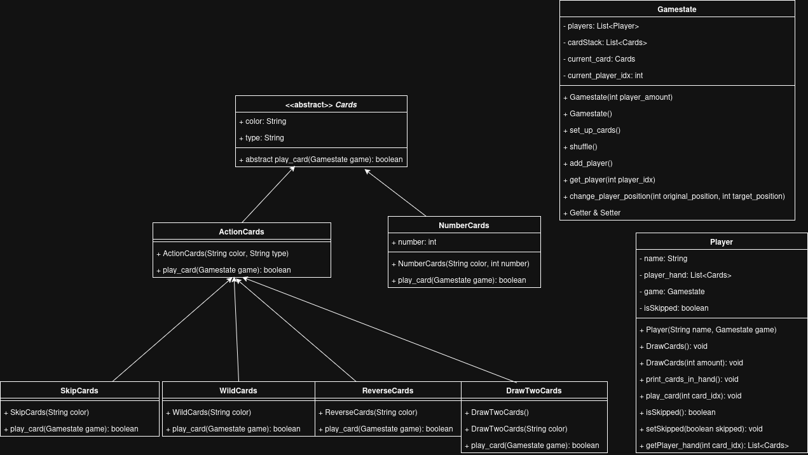
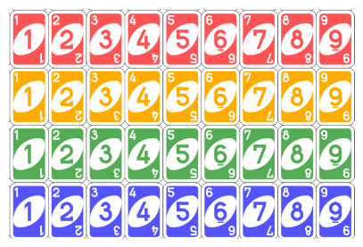
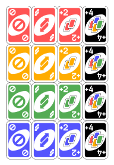

# UNO



## NumberCards


```
play_card(GameState game){
    - Jika current card memiliki nomor yang sama ATAU warna yang sama dengan kartu ini maka jadikan current card menjadi kartu ini
    - Jika current card == null jadikan current card menjadi kartu ini   
}
```

## ActionCards


## SkipCards:
```
play_card(GameState game){
    - Skip player selanjutnya
    tips: ubah value isSkipped player selanjutnya menjadi true
}
```

## ReverseCards
```
play_card(GameState game){
    - Membalik urutan player
    contoh: {player1,player2,player3,player4} -> {player4,player3,player2,player1}
    - Ubah current card menjadi kartu ini 
}
```


## DrawTwoCards
```
play_card(GameState game){
    - Menambah 2 kartu pada player selanjutnya
    - Mengurangi 2 kartu terdepan pada tumpukan kartu
    - Ubah current card menjadi kartu ini
}
```

## WildCards
```
play_card(GameState game){
    - Menambah 4 kartu pada player selanjutnya
    - Mengurangi 4 kartu terdepan pada tumpukan kartu
    - Konstruktor kelas harus fleksibel (overloading), memungkinkan instansiasi dengan parameter warna yang ditentukan pemain atau tanpa warna (null)
    - Ubah current card menjadi kartu ini
}
```

<hr>

